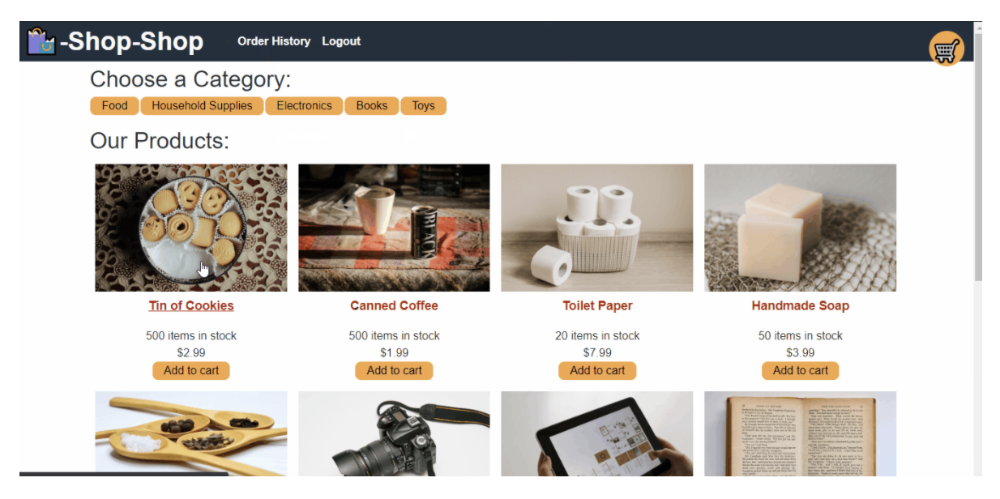

# Shop Shop 

This was a refactoring assignment to take a working e-commerce platform and refactor the code to fit with the Context API with Redux. The working platform is called Shop Shop 

You can view the deployed app here: https://gentle-harbor-79076.herokuapp.com/ 

# About the Developer

My name is Naomi and I am a junior developer studying fullstack javascript developement through UCLA extension. Visit my github at https://github.com/naomiilang

Thanks for stopping by :)